# Ch.1 Logic

## Proposition

**Proposition**: a state that either cosidered true or false but not "depends".

**Proposition Operators**: conjunction, disjunction, exclusive or, negation, condition and biconditional statements.

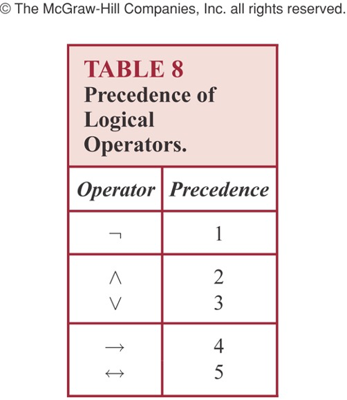

**Converse、Inverse、Contrapositive**: 难点应该在不记得哪个是哪个

**Consistent**: A list of propositions is *consistent* if it is possible to assign truth values to the proposition variables so that each proposition is true.

## Logical Laws

## Predicate and Quantifier

The quantifiers have **higher precedence** than all logical operators from propositional calculus.

All the variables in a **propositional** function **must be quantified** or set equal to a particular value to turn it into a proposition.

### Nested Quantifiers

The order of nested quantifiers **matters** when they're of different types

Negating nested quantifiers by **successively** applying the rules for negating statements involving a single quantifier

### Quantification Equivalance 

先讨论量词没有嵌套（只有一个变量）的等式变形。

1. 当一个变量只有一个谓词时：

   

   

2. 当有多个关于同一个变量的谓词时：

   

   

3. 当有多个变量时：

   

4. 当有Negation时：

   

## CNF、DNF

**Conjunctive Normal Form**: A conjunction with several disjuntive clauses

**Disjunctive Normal Form**: A disjunction with several conjunctive clauses

注意两者并不是对立的关系，有的表达式同时符合两者的要求。

### Convert into CNF/DNF

**Distribution Law** is the key.

We've learned that any statement can be easily presented in CNF. By distribution law, conjunctions can be absorbed into sub-statements. Here's an example.

### **Full DNF**

A **minterm** is a conjunction where each variable is presented exactly once.

A **Full DNF** is a disjuntion of minterms.

We can easilly present any formula in Full DNF from its truth table.It's also easy to tell whether a statement is tautology or contradiction with Full DNF. 

## Prenex Normal Form

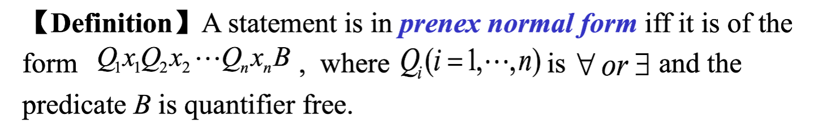

We can convert any statement into PNF by 4 steps:

1. Remove $\rightarrow$ and $\leftrightarrow$
2. Move negations to the back of quantifiers
3. Rename variables if needed
4. **Move all quantifiers to the front**

We've learned all equivalances that these 4 steps need. Please review them in section *Predicate and Quantifiers*.

## Arguments

Actually we've already learned argument. An **argument** is a sequence of statements that end with a conclusion. Mathematically, argument is a statement like $A\rightarrow B$, in which we call B a conclution.

Argument is **valid** iff its a tautology, which means the conclution must be true if prerequisites are all true.

For example, what below is a valid argument.

There's another format to write down an argument.

## Rules of Inference

### Modus Ponens/Tollens

Modus Ponens/Tollens是三段式 (**Syllogism**) 推理的两个方向，他们合称为推理规则：

1. 已知P->Q
2. 因为P/因为非Q
3. 所以Q/所以非P

用离散数学的记号表达为：

|                         Modus Ponens                         |                        Modus Tollens                         |
| :----------------------------------------------------------: | :----------------------------------------------------------: |
|  |  |

单独看它是废话，但是在复杂的Argument的证明中，它发挥了很大的作用，比如如果我们想证明下面这个Argument是否valid：

除了真值表，我们可以从他自己出发进行演绎，也就是反复应用推理规则：

### Resolution

Resolution is kind of more a simplification of current statements than a logical inference. But it still helpful when conditions hide behind others.

### Another trick

### Inference with Quantifiers

Four rules in all. Two for universal quantifier and two for existential quantifier; two for inference from specific cases to statements, and two for inference from statements to cases.

**Universal modus ponens/tollens**:

## Theorem and Proof

**Theorem** and proposition are synonyms, which mean a statement that can be shown to be true or false.

**Proof** is the abstraction of the logic and procedure people used to tell the truth of theorem.

- **Direct Proofs**
- Proof by **Contraposition**: any theorem is equivalant to its contraposition.
- Proof by **Cases and Contradictions**: basically tell the truth table of the theorem and check if it's a tautology.
- **Backward Reasoning**: Proof that the negation of conclusion is impossible.

For theorem of shape like $p\rightarrow q$, if already know that p is false or q is true, the theorem is apparently true but the proof is trivial and vacuous.

# Ch.2 Set

## Set

- **Cardinality**: the number of distinct elements in a set.
- **Power Set**: the power set of S is the set of all subsets of the set S.
- **The ordered n-tuple** *(a1,a2,…,an)* is the **ordered** collection that has a1 as its first element, a2 as its second element, … , and an as its nth element.
  - Parentheses usually means ordered, while brace means unordered.
- **Cartesian product**: , a set of **ordered pair** (ordered 2-tuple).
- **Truth Set**: $P = \{x\in D\ |\ P(x) \}$ Given a predicate P, and a domain D. The truth set of P is the set of elements x in D for which P(x) is true.
- Be careful of the **symbols**: $s\in \{s\},\ \{s\} \subset\{s\},\ \{s\}\in\{\{s\}\}$
  - $element\in set$
  - $set\subset set$
- **Algorithms**
  - $\overline{A\cup B}=\overline{A} \cap \overline{B}$
  - $A \cap(B\cup C) = (A\cap B)\cup (A\cap C)$
  - $(A - B)\cup B = A \cup B$

## Set Operation

集合运算肯定会这里不讲，主要讲写证明的格式。证明两个集合相等/不等时，一般有两种套路：

1. 直接对集合运算做变换。

   

2. Membership Table其实就是真值表啦。

   

## Function

### Definition

Let A and B be non-empty sets. A **function (mapping or transformations)** f from A to B:
$$
f: A\rightarrow B \\
\forall a(a\in A\rightarrow \exists!b(b\in B \and f(a) = b)
$$

- A is called the **domain** of f , B is called the **codomain** of f. 
- b is called the **image** of a under f, a is called a **preimage** of b.

### Different Kinds of Func

下面还有各种函数的分类，注意英语名词和数学表达：

1. **One-to-one function (Injection)**: 

   ​		每一个x都有唯一的y与之对应，对不同的x一定有不同的f(x)

2. **Onto function (Surjection)** : 

   ​		每一个y都有唯一的x与之对应，因变量所在的集合中每一个元素都被映射到

3. **Bijection**: 

   ​		one-to-one and onto, 双向严格一对一

4. **Monotonic Functions**: 

   ​		单调函数

5. **Inverse Function**: 

   ​		$f^{-1}(y) = x\ \iff\ f(x) = y$，只有双射才有反函数，否则一对多不符合函数的性质

6. **Compositions of Functions:**

   ​		$f^\circ g(x)=f(g(x))$, which can only be defined when the codomain of g is the subset of the domain of f.

### Floor/Ceiling Func

Special properties shown below.

### Sequence

A **sequence** is a **function** from a subset of the set of integers (usually either the set {0, 1, 2, …} or the set {1, 2, 3, …}) to a set S. 

A **geometric progression** is a sequence of the form:
$$
a, ar, ar^2, ar^3 ...ar^n
$$
An **arithmetic progression** is a sequence of the form:
$$
a, a+d, a+2d, a+3d ... a+nd
$$

## Cardinality

Cardinality indicate the number of elements in a set. 

The cardinality of a set A is **equal** to the cardinality of a set B, denoted | A | = | B |, iff there exists a **bijection** from A to B.

If there is an **injection** from A to B, the cardinality of A is **no more than** the cardinality of B and we write |A| ≤ |B|.

A set that is either **finite or has the same cardinality as the set of positive integers** called **countable**. A set that is not countable is called **uncountable**.

### 康托对角化

康托对角化常用于证明区间不可数，例如下面证明(0, 1)区间不可数：

1. 假设这个区间可数无穷，那么它可以被枚举为(r1, r2, r3, ...)

2. 这些数肯定都可以用小数表示，将它们记为：

   

3. 对r1的小数表示，如果它第一位小数是3，就把它改成4；如果它第一位小数不是3，就把它改成3。对r2的小数表示，如果它第2位是/不是3，就把它改为4/3；对r3......

4. 第三步变换中不一定是3/4，可以是随意两个数字。经过上面的变换，得到一个新的集合，这个集合一定不在原集合中（小数表示中总有一位和原数不一样），但又应该在集合中（显然经过变换仍然属于(0, 1) ），矛盾。

5. 矛盾的原因是假设不成立，证毕。

### 一些证明题

证明集合等势/可数/不可数有很多小技巧：

***

***

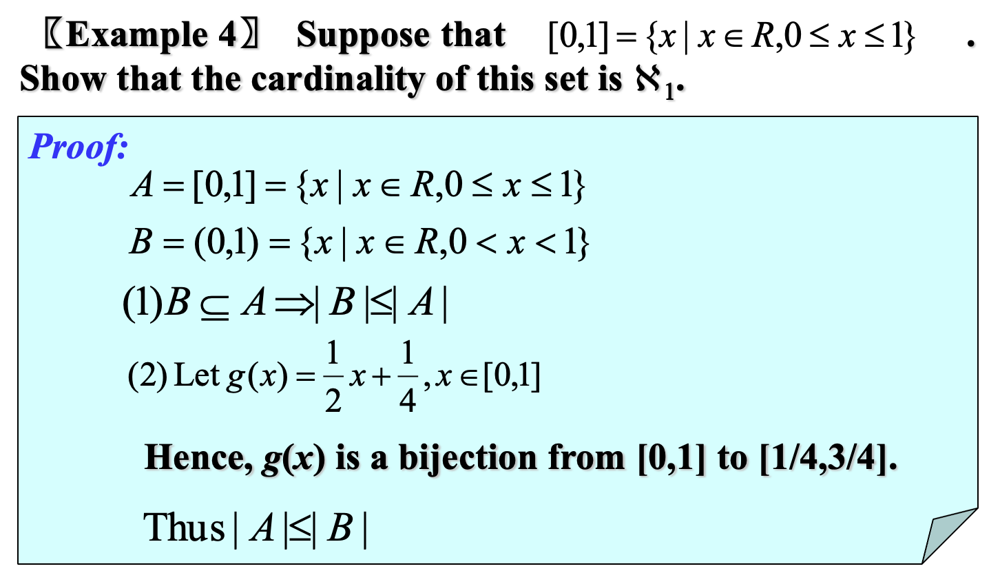

***

# Ch.3 Algorithm

## Properties of Algs.

- **Input**

  ​		An algorithm has input values from a specified set.

- **Output** 

  ​		From each set of input values, an algorithm produces output values from a specified set.

- **Definiteness** 

  ​		The steps of an algorithm must be defined precisely.

- **Correctness** 

  ​		An algorithm should produce the correct output values for each set of input values.

- **Finiteness**   

  ​		An algorithm should produce the desired output after a finite number of steps for any input in the set.

- **Effectiveness** 

  ​		Each step of an algorithm must be executed exactly and in a finite amount of time.

- **Generality** 

  ​		The procedure should be applicable for all problems of the desired form, not just for a particular set of input values.

## Greedy Algorithm

Algorithms that make what seems to be “best” choice at each step are called greedy algorithms.

## Halting Problem

Can we develop a procedure that takes as input a computer program along with its input and determines whether the program will eventually halt with that input?

No, that is impossible.

## Complexity

- **Big-O** Notation: Upper Bound
- **Big-Sigma** Notation: Lower Bound
- **Big-Theta** Notation: Both Big-O and Big-Sigma

Notice that O(log1 + log2 + log3 + ... + logN) = O(log N!) = O(N log N).

# Ch.5 Induction and Recursion

## Mathematical Induction

- Basis Step
  - P(n0) is true
- Inductive Step
  - Assume P(k, k > n0) is true
  - Prove P(k+1) is true based on P(k) is true.

## Strong Induction

- Basis Step
  - P(n0) is true
- Inductive Step
  - Prove 

## Well-Ordering Property

 A set S is well ordered if **every nonempty subset of S has a least element**. Such as:

- N is well ordered.
- Z is not well ordered because there's no smallest element.

There's a proof with well-ordering property: 

- We've already know that there's at least one circle with length no less than 3.
  - If the length is 3, it's tautology.
- The length of circles must be positive integer and we already know that Z+ is well ordered set. So there must be a smallest element which > 3 according to previous assumption.
- For the smallest circle p1, p2, ...pn, focus on the first 3 player p1, p2 and p3.
  - It's tournament so there's a game between p1 and p3.
  - If p3 wins, p1, p2, p3 form a circle with length 3.
  - If p1 wins, which means p1, p3, ...pn is supposed to be the shortest circle, contradict with the assumption.
- Q.E.D.

## Recursion

Recursion can not only defines special functions, **but sets**. For example:

## Structural Induction

# Ch.6 Counting

## Couting Rules

### Basic Rule

For example:

### Product Rule

For example:

### Substraction Rule

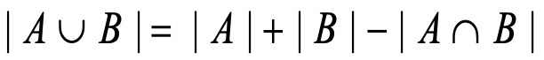

For example:

## Pigeonhole Principle

For example:

There are a lot of subtle proofs about pigeonhole principle. **It's highly recommended to have look through the PPT.**

## Permutation and Combination

公式略，注意Combination的写法：
$$
C^{13}_{25} = C(25,13)=  (\begin{matrix}25\\13\end{matrix})
$$

### Binomial Theorem

Some corollary can generate from binomial theorem:

- $\sum^{n}_{k=0}(C^{k}_{n})=2^n$, by letting x = 1 and y = 1
- $\sum^{n}_{k=0}((-1)^kC^{k}_{n}))=0^n$, by letting x = 1 and y = -1
- $\sum^{n}_{k=0}(2^kC^{k}_{n})=3^n$, by letting x = 2 and y = 1

### Palcal's Identity

### Vandermonde's Identity

## Generalized P. and C.

### r-Circle Permutation

How many ways are there to seat k people around a circular table? 
$$
\frac{k!}{k}
$$

### Object-Box Problem

1. **n个有区别的小球放进k个有区别的盒子**：
    - 每个小球都有k种放置选择，总可能性为$k^n$
    - 如果固定每个盒子最终有多少个小球，记为 $n_1, n_2, n_3...n_k$ 则转化为排列问题
        - 先对n个小球做全排列$n!$
        - 第$[1, n_1]$个球属于第一个盒子，以此类推；因此第i个盒子中存在$n_i!$中重复情况（盒子内部是组合不是排列）
        - 因此总情况是$\frac{n!}{n_1!n_2!...n_k!}$
        - 比如52张不一样的扑克，给4名玩家各发5张，可能性有$\frac{52!}{20!}*\frac{1}{5!5!5!5!}$
    - 如果要求盒子不能为空，可以用第八章的Inclusive-Exclusive规则计算
        - $k^n-C(1, k)(k-1)^n+C(2, k)(k-2)^n-C(3, k)(k-3)^n...$
        - 即减掉某一个盒子为空的，加上两个盒子为空重复减的，再减去三个盒子为空重复加的......
2. **n个有区别的小球放进k个无区别的盒子**：
    - **Stirling Numbers背公式吧**：S(n, k)代表n个不同小球放进k个相同盒子（不能为空）的方法个数
    -  
    - 如果盒子可以为空，可以分类讨论有1, 2, 3...k个盒子非空的情况，总可能性为$\sum^k_{i=1}S(n, i)$
3. **n个无区别的小球放进k个有区别的盒子**：
    - 隔板法
    - 如果盒子不能为空，等价为n-1个空隙插入k-1个隔板，$C^{k-1}_{n-1}$
    - 如果盒子可以为空，相当于n+k个相同球放进k个不能为空的不同盒子（每个盒子忽略一个球即可），$C^{k-1+n}_{n-1}$
4. **n个无区别的小球放进k个无区别的盒子**：
    - 课本是枚举的没有讲方法？？？

还有一类题是**不连续问题**，比如从书架上的12本书中取4本，要求不能取出两本连续的书。解法为最终会留下8本，加上两端共有9个空位，**问题等价于将4本书放入9个空位C(9, 4)**。空位之间至少有一本书，即保证了取出的书不连续，总之不连续要转化为插空问题。

### Generation Order

本节强调排列组合的枚举是有顺序的，

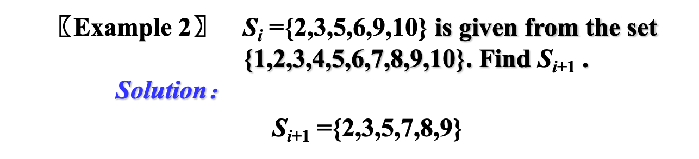

# Ch.8 Advanced Counting

## Concepts

- **Linear**

    Recurrence exp. is a linear combination of previous terms

- **Constant Coefficients**  

    The coefficients of all $a_i$s are constants

- **Degree k**

    Recursion definition of an is a function of at most previous k terms of the sequence

- **Homogeneous**

    If we put all the ai s on the left side of the equation and everything else on the right side, then the right side is 0. Otherwise nonhomogeneous.

It's a **linear** **homogeneous** recurrence relation **of degree k** **with constant coefficients**.

## Solve Linear R.

本节关心从递归式中推导出通项公式，核心思想是**递归的表达式应该是指数形式**：

0. 例如对于递推式$a_n = c_1a_{n-1} + c_2a_{n-2} +...+c_ka_{n-k}$

    这里是一个Homogeneous的例子，下面得到的方程是齐次的，非齐次的情况后面也会讲

1. 移到同侧$a_n - c_1a_{n-1} - c_2a_{n-2} -...-c_ka_{n-k} = 0$

2. 换成指数$r^n - c_1r^{n-1} - c_2r^{n-2} -...-c_kr^{n-k} = 0$

3. 降次$r^{k} - c_1r^{k-1} - c_2r^{k-2} -...-c_kr^{0} = 0$

第三步中得到的方程称为**特征方程**。

### 齐次

齐次的递推方程的生成函数有通解（General Solution），或者说我们可以找到无穷多组序列满足某个递推方程，{an}需要借助初始条件来唯一确定。

#### 齐次 没有重根

若特征方程有k个不重复的根$r_1,r_2...r_k$，则
$$
\{a_n\}是递推式\ a_n = c_1a_{n-1} + c_2a_{n-2} +...+c_ka_{n-k}的一组解\\
\iff \\
a_n可以表达为\ a_n = \alpha_1r_1^n + \alpha_2r_2^n + ... + \alpha_kr_k^n
$$
其中，alpha_i为常系数，随递推式初始值的确定而唯一确定。下面给出证明：

##### 前推后

$$
\begin{aligned}
& a_0 = C_0=\alpha_1 + \alpha_2 + ... + \alpha_k\\
& a_1 = C_1=\alpha_1r_1^1 + \alpha_2r_2^1 + ... + \alpha_kr_k^1\\\
& ...\\
& a_k = C_k=\alpha_1r_1^k + \alpha_2r_2^k + ... + \alpha_kr_k^k\
\end{aligned}
$$

对一个Degree K的表达式，当{an}是递推式的一组解，那么应该有若干初始值$a_i=C_i$与之对应，将初始值带入递推式可以得知alpha_i有解。比如在二阶下：

##### 后推前

将表达式带入$a_n = c_1a_{n-1} + c_2a_{n-2} +...+c_ka_{n-k}$的右侧化简即可，比如在二阶下：

#### 齐次 有重根

若特征方程根共有t个不相同的根，记为$r_1, r_2...r_t$，其中每个根的重复次数记为$m_1, m_2...m_t$
$$
\{a_n\}是递推式\ a_n = c_1a_{n-1} + c_2a_{n-2} +...+c_ka_{n-k}的一组解\\
\iff \\
a_n可以表达为
$$

即重复$m_i$次的根的系数应该是一个$m_i-1$次多项式。其中，$\alpha_{i,j}$为常系数，随递推式初始值的确定而唯一确定。

证明没讲。

### 非齐次

首先对非齐次的递推方程，若其存在关于F(n)的一组特解（Particular Solution），那么**它的解集是这组特解加上它的齐次形式的通解**。

前面已经讲解了齐次形式怎么找通解，现在如果非齐次部分F(n)形如则我们可以快速找到特解（不需要证明）：

- 下面t与非齐次项的形式相对应，n为递推项的序号
- 如果F(n)中的s是齐次特征方程的m重根，则特解可以表达为$a_n=$
- 如果s不是特征根，对应m=0，上式退化为$a_n=$
- 如果F(n)不含指数项，等价于s=1
- 将前面得到的表达式带回递推式，可以得到$p_i$，于是得到了特解

比如对于递推式$a_n = a_{n-1} + n$：

- 先处理齐次形式$a_n=a_{n-1}$
    - 特征方程$r-1=0$，得到特征根$r_1=1$
    - 得到通解$a_n = \alpha_1(1)^n=\alpha_1$
- 再处理非齐次的部分
    - 提取$F(n)=n$，得到s=1
    - s是1重特征根，特解表达为$a_n=n(p_1n + p_0)$
    - 上式带入$a_n=a_{n-1}+n$，即$n(p_1n+p_0)=(n-1)[p_1(n-1)+p_0]+n$，解得$p_0=p_1=\frac{1}{2}$
- 结合两者，得到解集$a_n=\alpha_1+n(\frac{1}{2}n+\frac{1}{2})$
- 如果提供了足够的初始值，可以带入解出alpha，便得到了唯一的生成函数
- **注意特解中未知数用递推式带入求解，通解中未知数用初始条件带入求解**

## Generating Function

For a sequence $a_1, a_2...a_n$, the generating function of this sequence means:

**Here are some basic transformations:**

### Appliance

There're some common cases that can be decuced from *(3) of Theorem 1.* **PLEASE remenber them.** (-1 < x < 1)

*Example 3* is based on the (5) of *Theorem 1* above, generalizations of what above.

**We need to solve the generating function from the sequence and also vise versa.**

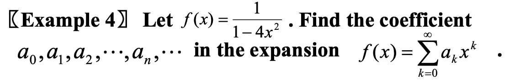

### Common Used Gen. Func

All these are starting from 0 to +inf.

## Extened Binomial Coeff.

### Extended combination

Definition of how combination works when m is not in [k, +inf).

### Extened Binomial Coeff.

With the extended combination, Binomial coefficient can also be extended for exponent n from non-negative integer to all real number.

**An important skill is:**
$$
\begin{aligned}
& For\ extended\ combination: \\
&\ \ \ \ \ \ \ \ C^{k}_{n}=\frac{n(n-1)(n-2)...(n-k+1)}{k!}, \\
& extract\ (-1)\ from\ every\ term\ of\ numerator, we\ got: \\
&\ \ \ \ \ \ \ \ \frac{(-1)^k(k-n-1)(k-n-2)(k-n-3)...(-n)}{k!}=(-1)^kC^{k}_{k-n-1} \\
\\
& Again:\\ 
&\ \ \ \ \ \ \ \  C^{k}_{n}=(-1)^kC^{k}_{k-n-1} \\
& It's\ important\ because\ it\ helps\ switch\ the\ place\ of\ variable\ in\ combination.

\end{aligned}
$$
For example: Find the generating function of $a_n=C^{2}_{n}$
$$
\begin{aligned}
First: &\\
& C^{2}_{n}=C^{n-2}_{n}=(-1)^k C^{n-2}_{(n-2)-n-1}=(-1)^k C^{n-2}_{-3}\\
Easilly\ to\ find: &\\
& (1-x)^{-3}=\sum^{\inf}_{n=0}C^{n}_{-3} (-x)^n\\
\\
\end{aligned}
$$

## Counting with Gen. Func.

### Base case

- Let the exponent of x represent the number of a certain kind of element. For example, x^5 indicate that 5 elements of this kind are picked.
- We can picked an arbitrary number of this kind of element, so all the cases can be represented as (1 + x + x^2 + x^3 +...) .
- It's also the same for every other kind of element. 

### Variant

***

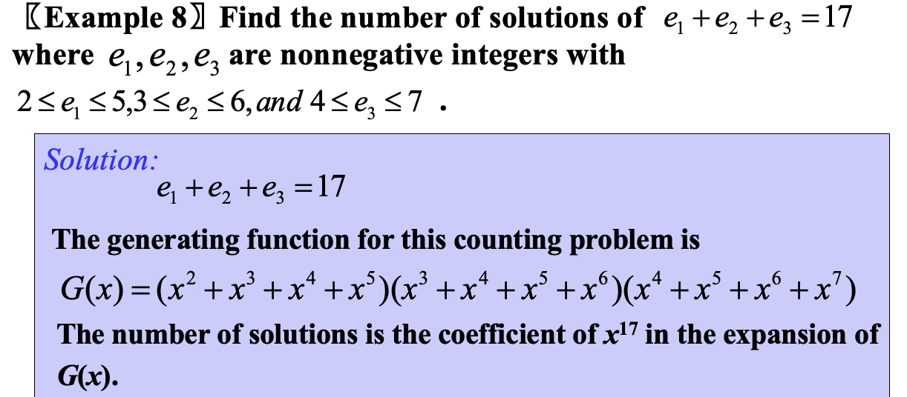

***

***

**这题特别注意顺序有关、顺序无关对生成函数的影响。**

***

**这道题为解递归方程提供了新的思路：**

- 两侧乘以x^n再累和，得到关于所求序列an的生成函数的方程
- 将生成函数当作变量，求解
- 再从生成函数解出每一项

同时特别注意求和必须a0开始，所以只有下标最小的$3a_{n-2}x^n$求和后为$3x^2G(x)$，另外两项要额外减去a0和a0+a1x

***

**这道题为组合公式证明题提供了新的思路：**

- 将组合视作通项，求生成函数
- 于是把组合层面上的等价关系转化到生成函数层面上

## Inclusive-Exclusive

### Concept

It means, for example A1 union A2 union A3:

- Count A1 and A2 and A3 seperately.
- However for those who are both in A1 and A2 (also A1-A3, A2-A3), they're counted twice. They should be subtracted.
- However for those who are in A1 and A2 and A3, they're counted 3 times in the first step but also substracted 3 times in the second step. They should be added back.
- Case with more sets is alike. 

### Examples

### Alternative Form

We also denote the formula like this:

This form frees us from abstract set, leading to specific constrants.

### Advanced Examples

# Ch.9 Relations

## Binary Relations

- Function is relation
- Relation on set A <=> Relation from A to A
- Can be represented as a table

**Example：**

1. A中有n个元素
2. Relation on A一定可以表达在A x A（笛卡尔积）矩阵上，这个矩阵的大小是n x n
3. 对矩阵中n^2个元素（每元素代表一个关系Term）任意组合，有2^(n^2)种取法

## Relation Properties

### Reflexive

For relation R on a set A, any element $x\in A$ must have $(x, x)\in R$.

如果用矩阵表示自反关系，矩阵对角线上的元素一定是1；如果用有向图表示自反关系，每个节点都有指向自己的一条边。

在n x n的矩阵上，自反关系的个数有：

- 对角线上必须全部是1，其他位置随意

### Irreflexive

与之对应的有**Irreflexive**，要求R中不存在形如(x, x)的term。**Reflexive和Irreflexive不是对立关系，某个关系可能两者都不是（但是两者互斥）。**

在n x n的矩阵上，自反关系个数的计算：

- 对角线上必须全是0，其他位置随意

### Symmetric

如果用矩阵表示对称关系，则矩阵也是对称的；如果用图表示自反关系，则图是无向的，或者有向图任何一条边都有与之对应的回边。

在n x n的矩阵上，对称关系的个数有：

- 对角线上元素随意
- 非对角线元素与其对称位置两两一组，同0/同1

他还有两个兄弟：

### Antisymmetric

**Symmetric和Antisymmetric不是互斥关系，某个关系可以两者都不是，也可以两者同时满足，比如下面这个例子：**

在n x n的矩阵上，反对称关系个数的计算：

- 对角线上元素随意
- 非对角线元素与其关于主对角线对称的位置不能同时为1（非对角线元素与其对称位置两两一组，00/01/10）

### Asymmetric

在n x n的矩阵上，反对称关系个数的计算：

- 对角线上元素必须全是0
- 非对角线元素与其关于主对角线对称的位置不能同时为1

### Transitive

在n x n的矩阵上，传递关系的个数有：

- 对角线上元素随意
- **非对角线元素？？**

## Combining Relation

### Logical Operation

关系也是集合，可以取交并补。关系取反是相对于整个关系矩阵取补；关系的减法也类似集合的减法。

注意区别关系取**Complement**和关系取**Inverse**两者的区别（对称关系取逆不变）：

### Composition

关系就像函数，可以前后复合。**特别注意，形如$S\circ R$是R的第一个元素在前，S的第二个元素在后，不要搞反。**

特别的是，关系的复合可以与矩阵的乘法相联系，同样**注意相乘的顺序**：

### Power of Relation

可以用数学归纳法证明**传递关系是幂等的。**

### Properties

## Closures of Relations

The closure of a relation R with respect to property P is the relation S with property P containing R such that S is a subset of every relation with property P containing R.

关系R对属性P的闭包，是R具有属性P的最小超集。

- **Reflexive Relation**：$R\cup I_a$，其中$I_a$为对角线
- **Symmetric closure**：$R\cup R^{-1}$
- **Transitive Closure**：$\cup^{\inf}_{n=1}R^n$，常记为$R^*$

### Transitive Closure

将首尾相接的边（关系中的一个Term，表达为ordered-pair）称为**Path**，Path的长度即其中边的个数。

引入一个简单的定理：

然后容易得到，传递闭包表达为$\cup^{\inf}_{n=1}R^n$。

****

如果A中只有n个元素，而又存在长度大于n的path，那么显然其中一定有环：

那么传递闭包就不用Union到无穷大了，只要到$|A|$即可：

容易得到上面的算法时间复杂度为O(N^4)。

### Warshall's Algorithm

1. 枚举所有的节点，记当前枚举的节点为k

    - **必须按顺序枚举**

    - 复杂度N

2. 按照传递闭包的规则，如果有两个节点依赖k节点搭桥，则应该有一条边直连这两个节点

    - (A\[i\]\[k\] && A\[k\]\[j\]) => A\[i\]\[j\]

    - 遍历所有有序对(i, j)，复杂度N^2

这样得到的结果矩阵就是传递闭包，充分性不需要证明。于是复杂度降低到了O(N^3)，同时这个算法还非常适用于向量化加速：

1. 按顺序枚举节点，这里从a开始
2. b出发可以到a（A\[b\]\[a\] == 1），则a出发能到达的节点也可以从b出发（**a所在的行与b所在的行按位或**）
3. 以此类推

于是这个算法向量化改造为：

1. 枚举节点k
2. 如果k所在的列中，第i行为1，则两行按位或再赋给第i行（row[i] := row[i] || row[k]）

## Equivalence Relation

### Definition

### Partition of  Set

**No overlap** between two parts of a patition. For example:

****

Let R be an equivalence relation on a set A. 

- The equivalence classes of R form a partition of A.
    - 证明等价类满足Partition的三条性质
- Conversely, given a partition of the set A, there is an equivalence relation R that has the sets $A_i$, as its equivalence classes.
    - 令关系 R={(a, b)|a, b都在$A_i$中}，证明这个关系自反、对称、传递

## Ordered Set

### Partial Order

The elements a and b of a poset (S, ≼) are **comparable** if either a ≼ b or b ≼ a. When a and b are elements of S so that neither a ≼ b nor b ≼ a, then a and b are called **incomparable**.

### Total Order

If (S, ≼) is a poset and **every two elements of S are comparable**, S is called a totally ordered or linearly ordered set, ≼ is called a total order or linear order. In this case (S, ≼)  is also called a chain.

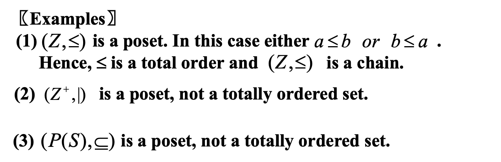

(A, ≼) is a poset and $B\sub A$. If (B, ≼) is a totally ordered set, then B is called a **chain** of A. Conversely, if any of two elements in B cannot be compared, then B is called a **antichain** of A.

### Lexicographic Order

Given two posets (A1, ≼1) and (A2, ≼2), the lexicographic ordering on A1 ⨉ A2 is defined by specifying that (a1, a2) is less than (b1,b2), that is, (a1, a2) ≺ (b1,b2), either if a1 ≼1 b1 or if a1 = b1 and a2 ≼2 b2.

It can be extended to string with arbitary finite number of letters.

### Hasse Diagram

Hasse diagram is a method used to represent a partial ordering.

To construct a Hasse diagram:

1. Construct a digraph representation of the poset (A, R) so that all arcs are **pointed upward** (except the loops).

    **注意箭头朝上，整张图是向上生长的，方向如果画反了，从Hasse图里得到的上下界也都反了。**
2. Eliminate all loop.
3. Eliminate all arcs that are redundant because of transitivity.
4. Eliminate the arrows at the ends of arcs since everything points up. 

### Maximal/Minimal Element

Let (A, ≼) be a poset and $a\in A$. Then a is a maximal element if there does not exist an element b in A such that b ≼ a. Likewise there's also Minimal Element

Maximal/minimal element is the top/botton of Hasse Diagram. There can be more than one maximal and minimal elements in a poset. And any non-empty poset must have maximal and minimal element(s).

### Greatest/Least Element

Let (A, ≼) be a poset and $a\in A$. Then a is a greatest element if every other element b in A have b ≼ a. Likewise there's also least Element.

There may be no Greatest or Least Element in a poset. And if there'is,l it must be unique.

A poset (A, R) is **well-ordered** set if every nonempty subset of A has a least element. For example:

### Bound and Lattice

Let A be a subset of S in the poset (S, ≼). If   there exists an element a in S such that for all b in A, b ≼ a, then a is called an upper bound of A. Similar definition for lower bounds.

A poset is called a **lattice** if every pair of elements has a lub and a glb. For example:

But poset below is not a lattice because (1, 3) has no glb.

### Topological Sorting

Constructing a compatible total ordering from a partial ordering is called topological sorting.

拓扑排序，即生成的序列不违背偏序关系——若有关系a ≼ b，则生成的序列中a应该在b之前。

# Ch.10 Graph

## Definition

A graph G=(V,E) consists of V, a nonempty set of vertices (or nodes) and E, a set of edges. Each edge has either one or two vertices associated with it, called its endpoints. An edge is said to connect its endpoints.

- **Simple Graph**: All edges connoect two different vertices. No tow edges connect a same pair of vertices.
- **Multigraph**: Allow multiple edges connecting the same vertices.
- **Pseudograph**: Allow multiple edges connecting the same vertices, and edges pointing at the vertice which it start from.

- An edge e connecting u and v is called **incident with** vertices u and v, or is said to connect u and v. 
- The vertices u and v are called **endpoints** of edge {u, v}.
- **Loop** here means an edge which start and end at a same vertice.

### Degree

The **degree** of a vertex in an undirected graph is the number of edges incident with it, except that a loop at a vertex contributes twice to the degree of that vertex.

- If deg(v) = 0, v is called **isolated**.
- If deg(v) = 1, v is called **pendant**.

任何一条边有始有终，因此无向图所有节点的degree之和一定是偶数（度为奇数的节点个数一定是偶数）

****

As to directed graph. The **in degree** of a vertex v, denoted deg-(v) is the number of edges which terminate at v. Similarly, the **out degree** of v, denoted deg+(v), is the number of edges which initiate at v.

### Special Graphs

#### Complete Graphs

Exactly one edge between every pair of distinct vertices.

#### Cycles

#### Wheels

Add one additional vertex to the cycle Cn and add an edge from each vertex in Cn to the new vertex to produce Wn.

#### N-Cubdes

Qn is the graph with 2n vertices representing bit strings of length n. An edge exists between two vertices that differ in exactly one bit position.

#### Bipartite Graphs

A simple graph G is **bipartite** if V can be partitioned into two disjoint subsets V1 and V2 such that every edge connects a vertex in V1 and a vertex in V2.

二分图要求可以把图中的点分成两个集合，使得每一条边都链接这两个集合，而不存在任何边链接同属一个集合的两个点。

It's not a bipartite graph:

It's bipartite:

because it can be displayed like this:

****

A simple graph is bipartite if and only if it is possible to assign one of two different colors to each vertex of the graph so that no two adjacent vertices are assigned the same color. 

#### Complete Bipartite Graph

For a bipartite graph, if every vertex in V1 is connected to every vertex in V2 and vise versa, it's considered as a complete bipartite graph.

Let $|V_1|=m,\ |V_2|=n$ , we denote the corresponding complete bipartite graph as $K_{m, n}$. 

#### Regular Graph

A simply graph is called regular if every vertex of this graph has the same degree. A regular graph is called n-regular if every vertex in this graph has degree n.

For example, Kn is a (n - 1)-regular graph.

### Subgraph

- F is a **subgraph** of G iff $V_F\sub V_G$ and $E_F\sub E_G$.
- F is a **spanning subgraph** of G if iff $V_F= V_G$ and $E_F\sub E_G$.
- F is a **proper subgraph** of G if H is a subgraph of G and $H\ne G$.

****

How many subgraphs with at least one vertex does W3 have?

1. Select 1 node, with no edge.
2. Select 2 nodes. For each kind of node selection, an edge can be included or excluded.
3. Select 3 nodes. For each kind of node selection, 3 edges can be included or excluded perspectively.
4. Select 4 nodes. For each kind of node selection, 6 edges can be included or excluded perspectively.

## Graph Representations

### Adjacency Matrix

For multigraph and pseudograph, adjacency matrix is not longer needed to be a 0-1 matrix:

The sum in a row of the adjacency matrix indicates the out degree of a node, including loop.

### Indicence Matrix

Let G = (V, E) be an **undirected** graph. Suppose that $v_1, v_2...v_n$ are the vertices and $e_1, e_2...e_n$ are the edges of G. Then the incidence matrix with respect to this ordering of V and E is $n*m$ matrix $M=[m_{ij}]_{n*m}$ , where

For example:

## Connectivity

### Path

#### Definition

- A path of length n in a directed graph is a sequence of vertices v0, v1. . .vn such that (v0, v1) , (v1, v2) , ..., (vn-1, vn) are n directed edges in the graph.
- Circuit or cycle : the path begins and ends with the same vertex.
- **Simple path**: the path does not contain the same edge more than once.

#### Counting Path

The number of different paths of length r from vi to vj is equal to the (i, j)th entry of $A^r$, where A is the adjacency matrix representing the graph consisting of vertices v1, v2, . . . vn.

For example:

The number of paths not exceeding 6 are there from v4 to v5: $a_{45}$ in $A+A^2+A^3+A^4+A^5+A^6$, which is 2.

### Undirected Connectedness

An **undirected** graph is called connected if there is a path between every pair of distinct vertices of the graph. The maximally connected subgraphs of G are called the **connected components** or just the components.

For example, this graph is not connected and it has 4 connected components:

### Cut Vertex/Edge

A vertex/edge is a cut vertex (an articulation point) / a cut edge (a bridge), iff removing it results in more connected components than in the original graph.

For example:

In star graph, all edges are cut edges and the vertex in the center is the only cut vertex.

### Directed Connectedness

A **directed** graph is **strongly connected** if there is a path from a to b and from b to a for all vertices a and b in the graph. The graph is **weakly connected** if the underlying undirected graph is connected. By the definition, any strongly connected directed graph is also weakly connected.

## Isomorphism

Formally, two simple graphs G1= (V1, E1) and G2= (V2, E2) are isomorphic if there is a bijection f from V1 to V2 such that for all a and b in V1, a and b are adjacent in G1 iff f(a) and f(b) are adjacent in G2.

Such a function f is called an isomorphism.

Inportant invariants in isomorphic graphs:

- The number of nodes and edges.
- The degrees of vertices.
- If one if bipartite/complete/wheel..., the other must be.
- The number and size of connexted components.
- Same length of all simpoe circuits.
- Same length and degrees of corresponding vertices of paths.

These traits can help identify whether two graphs are isomorphic or not. For example:

These two graph is not isomorphic because the right one contains circuits of length 3 but the left one doesn't.

## Euler Path

- **Euler Path**: An Euler path is a simple path containing every edge of G. 
- **Euler Circuit**: An Euler circuit is a simple circuit containing every edge of G.
- **Euler Graph**: A graph contains an Euler circuit.

### In Undirected Graph

- Necessary Condition:
    - The vertex it begin and end with must have an even degree for **Euler path**.
    - All vertices must have an even degree for **Euler circuit**.
    - The vertices **Euler circuit** travels through must have an even degree.
-  Sufficient Condition:
    - Construct a simple circuit in G, deleting egdes in this circuit from G, and deleting all vertices with degree zero after that from G.
        - In a simple circuit, all vertices have degree 2.
        - The remains of G, denotes as H, still have vertices with even degree.
    - Let w be a vertex which is the common bertex of the circuit and H. Beginning at w, counstruct a simple path in H, and do the same thing above.
    - Loop until no edges remains. (要证明为什么最终一定可以删完所有节点，即为什么所有点的度都是偶数时一定有环存在吗？)

****

A connected multigraph has an Euler path but not an Euler circuit if and only if it has exactly two vertices of odd degree. 

令两个度为奇数的点分别作为Euler Path的起终点，证明同上。

### In Directed Graph

A directed multigraph having no isolated vertices has an Euler circuit if and only if 

- The graph is weakly connected.
- The in-degree and out-degree of each vertex are equal.

A directed multigraph having no isolated vertices has an Euler path if and only if 

- The graph is weakly connected.
- The in-degree and out-degree of each vertex are equal for all but two vertices, one that has in-degree 1 larger than its out-degree and the other that has out-degree 1 larger than its in-degree. 

条件与证明和无向图基本相同，区别只在于需要将Degree细分为入度和出度。

## Hamilton Path

- **Hamilton Path**: A path which visits every vertex in G exactly once.
- **Hamilton Circuit**: A cycle which visits every vertex exactly once, except for the first vertex, which is also visited at the end of the cycle.
- **Hamilton Graph**: A graph has a Hamilton circuit.

### Sufficient Condition

No need to proof these two theory.

- **Dirac Theorem**

    If G is a simple graph with n vertices with n>=3 such that the degree of every vertex in G is at least n/2, then G has a **Hamilton circuit**.

- **Ore Theorem**

    If G is a simple graph with n vertices with n>=3 such that deg(u)+deg(v) >= n for every pair of nonadjacent vertices u and v in G , then G has a **Hamilton circuit**.

### Necessary Condition

- The necessary condition for the existence of **Hamilton path**

    - G is connected.
    - There are at most two vertices which degree are less than 2.

- The necessary condition for the existence of **Hamilton circuit**

    - The degree of each vertex is larger than 1.

    - If a vertex in the graph has degree two, then both edges that are incident with this vertex must be part of any Hamilton circuit.

    - When a Hamilton circuit is being constructed and this circuit has passed through a vertex, then all remaining edges incident with this vertex, other than the two used in the circuit , can be removed from consideration.

    - If a graph has Hamilton circuit, for any nonempty subset S of set V, the number of connected components in G-S is not larger than |S|.

        - 简单介绍证明思路

        1. 取G的Hamilton Circuit，记为H
        2. 从H中选一个节点删除，环被打开为一条链，剩余1个联通分量
        3. 从一条链中选任意k-1个节点删除，链至多被拆成k段，即k个联通分量
        4. 于是证明了对H，删除k个节点（|S|=k），剩余联通分量的个数不大于k
        5. 而H是G的子图，G与H删去同样的节点后，剩余部分G‘的联通分量个数显然不大于H’部分的

## Shortest Path

边带有权重，引申出最短路径问题。

### Dijkstra

1. 设出发点的距离为0，其余所有点的距离为无限大
2. 从所有点中选出没有被Fix的，距离最小的点，将这个点标记为Fixed
3. 更新从出发点到2中选出的点的路径
4. 更新2中选出的点的邻居的距离（松弛）
5. 回到2，循环上述步骤直到所有点都Fixed

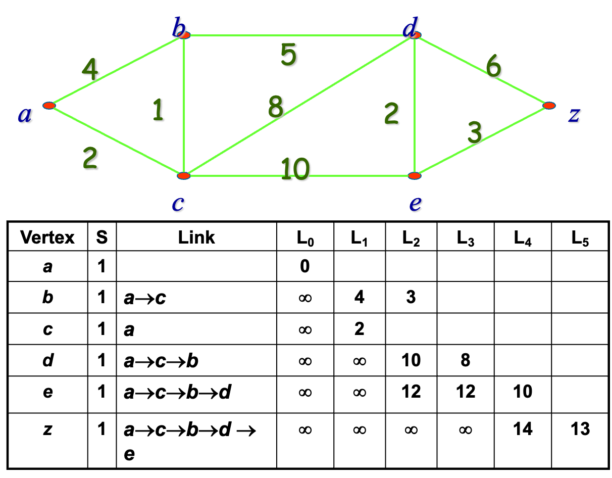

**注意上面这张表的画法，考试的时候要写过程就是把这张表画出来，跟着算法步骤慢慢填满**

### Proof of D.

首先明确，在Dijkstra算法中，每个点都有距离信息L：

1. 对Fixed的点k，$L_k$即出发点到该点的最短路径长度
2. 对Unfixed的点n，$L_n$是**从出发点开始，中途只经过目前已经Fixed的点，到达该点的最短路径长度**

下面用数学归纳法证明正确性。

1. Base Step：

    第0次迭代，Fixed出发点，显然成立

2. Inductive Step：

    假设第K次迭代上面三者成立，证明第K+1次迭代三者同样成立。

    - 反证法：记第K+1轮选出的点为v，连接到原fixed集合的边为(u, v)；假设存在另外一条路径，使从出发点到v的路径长度小于$L_v$，那么**分类讨论这条更短的路径上倒数第二个点x是否Fixed**

    1. 如果x Fixed，那么有$L_x + dist(x, v) < L_u + dist(u, v)$。这是不可能的，与$L_v$的松弛规则矛盾。

        

    2. 如果x Unfixed，那么有$L_x + dist(x, v) < L_v$。这也是不可能的，因为这意味着$L_x<L_v$，那么K+1轮应该直接选择x（或者x之前的Unfixed节点）而不是v，与算法过程相矛盾。

        

## Euler's Fomula

### Plannar

A graph is called **plannar** if it can be draw in a plane with no edges crossing. Such drawing is called a **plannar representation** of this graph.

### Region

A region is a part of the plane completely disconnected off from other parts of the plane by the edges of the graph. Region is either bounded or unbounded.

For example, there're 4 regions and only region no.4 is unbounded.

The number of edges on the boundary of region R is called **the degree of R**. R3 above is of 4 degree. For simple graph, the degree of region is at least 3.

### Euler's Fomula

Let G be a **connected planar simple graph** with e edges and v vertices. Let r be the number of regions in a planar representation of G. Then r=e-v+2. It's a necessary condition of planar graph.

Proof with mathematical induction:

1. 图中只有一个点没有边，上式成立

2. 如果图中有多于一个点，则任意选中一个点作为初始条件，**每次选择一条 至少有一个点已经被选中的 边加入其中**

    1. 如果这条边上只有一个点被选中，另一个点没有，则新增这条边不会使Region增加

    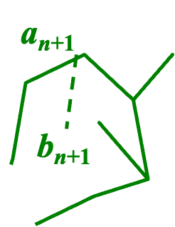

    2. 如果这条边上两个点都已经被选中了，则会使Region+1

    

因为原图是连通的，这样选择一定可以覆盖所有的边。每次选边，要么消耗一个没有被选中的点，要么使Region+1；即在初始条件之上，剩余的边数和点数的差值，即Region增加的数量；于是证明了欧拉方程。

### Corollaries

If G is a **connected planar simple graph** with e edges and v vertices where v≥3, then $e\le 3v-6$. 

1. $2e=\Sigma\ deg(Ri)\ge 3r $, therefore $ r\le \frac{2}{3}e$
2. Using Euler's Formula $e-v+2=r$, we get $ e-v+2\le \frac{2}{3}e$, shows that $e\le 3v-6$

For unconnected planar simple graph, $e\le 3v-6$ also holds, since every connected component has it.

The equality holds if and only if every region has exactly three edges. Generally, if every region of a connected planar simple graph has at least k edges, then $e\le \frac{(v-2)k}{k-2}$

****

If G is a **connected planar simple graph**, then G has a vertex of degree not exceeding five.

By Corollary 1 , we know that e≤3v-6 , so 2e≤6v-12. If the degree of every vertex were at least six, then 2e>6v.

### Example

Show that k5 and k33 is not plannar.

The graph k5 has 5 vertices and 10 edges. However, the inequality e <= 3v-6 is not satisfied for this graph since e=10 and 3v-6=9. Therefore, k5 is not planar. Neither is k33.

## Kuratowski's Theorem

### Homemorphic

The graph G1=(V1,E1) and G2= (V2,E2) are called **homeomorphic** if they can be obtained from the same graph by a sequence of elementary subdivision (细分).

Such as:

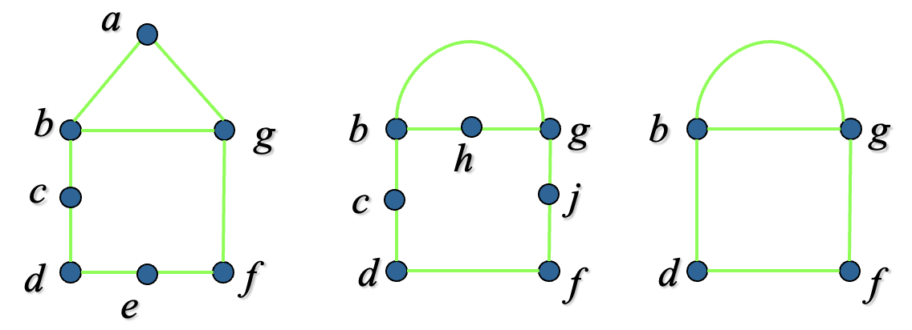

### Kuratowski's Theorem

A graph is nonplanar if and only if it contains a subgraph homeomorphic to K33 or K5. (No need to proof)

注意一个常用的证明nonplannar的技巧是**删除一些点或边来凑K33或K5的同构**。因为删除一些边之后都nonplannar，加上他们就更加nonplannar。

比如下面两张图都nonplannar：

因为他们各自可以删掉一些边，变成K33和K5:

类似的还有：

## Graph Coloring

### Dual Graph

Each map in the plane can be represented by a graph, namely the **dual graph** of the map.

- Each region of the map is represented by a vertex. 
- An edge connects two vertices if the regions represented by these vertices have a common border. 
- Two regions that touch at only one point are not considered adjacent.

### Chromatic Number

The chromatic number of a graph is the least number of colors needed for a coloring of this graph, denoted by x(G).

涂色问题的一个经典应用是解决冲突问题，xx和yy不能同一时间发生/zz和ww不能相邻类似的安排问题都可以转化为涂色问题。

### 4 Color Theorem

The chromatic number of a **planar** graph is no greater than four. (No need to proof)

# Ch.11 Trees

A tree is a **connected undirected** graph with **no simple circuits**, which suggests that all tree is bipartite.  An undirected graph is a tree if and only if there is a unique simple path between any two of its vertices.

Once specify a **root** in a tree, we direct each edge away from the root. Thus, a tree with its root produces a directed graph.

## Full m-ary Tree

这里的**满**树指的是，**树中的节点要么是叶节点，要么有m个子节点**。对满m叉树，已知其有i个内部节点：

- 有$mi+1$个节点
- 有$(m-1)i+1$个叶节点

也就是说，对满m叉树，总节点数、内部节点数和叶节点数三者可以相互推导。

例题：

A chain letter starts when a person sends a letter to five others. Each person who receives the letter either sends it to five other people who have never received it or does not send it to anyone. Suppose that 10000 persons send out the letter before the chain ends and that no one receives more then one letter. How many people receive the letter, and how many do not send it out? 

1. internal node i = 10000, m = 5
2. leaf node l = (5 - 1) \* 10000 + 1 = 40001

## Height and Balance

**Level/Height**是从根节点到目标节点/最下层节点的路径长，**从0开始**。

A rooted m-ary tree of height h is called **balanced** if all its leaves are at levels h or h-1.

## Binary Search Tree

- Rooted.
- Node value is distinct.
- Value of each vertex in the tree is less than every value in its right subtree, and greater than every key in its lefy subtree.

## Decision Tree

- Rooted.
- Each internal vertex corresponds to a decision, with a subtree at these vertices for each possible outcome of the decision.

Example: Counterfeit coin detection

## Prefix Coding Tree

比如Huffman Code，细节略。

## Traversal

前中后序遍历。

计算前/后序表达式的方法，可以用栈（略），也可以**还原成树**，只有叶节点是数字，非叶节点都是运算符。

比如：

- Prefix form: \* - 8 5 / + 4 2 3
- Postfix form: 8 5 - 4 2 + 3 / \*

它们对应的是同一棵树：

还原树的方法：

1. 后序从左往右看，前序从右往左看
2. 每次遇到数字，按顺序放最右边/左边
3. 每次遇到符号，将其左侧/右侧的两个数字或子树连在一起

比如这里后序建树：

前序建树：

## Spanning Tree

Let G be a simple graph. A spanning tree of G is a subgraph of G that is a tree containing every vertex of G.

**DFS** and **BFS** to find spanning tree.

### Backtracting

回溯算法，将可能解的枚举表达为决策树。比如：

### Minimum Spanning Tree

A minimum spanning tree in a connected weighted graph is a spanning tree that has the smallest possible sum of weights of its edges.

### Prim's and Kruskal's Alg.

They're both algorithms to find minimun spanning tree by select edge with smallest weight and does not form a simple circuit each time. The difference is:

- Prim: select edge among which are incident to a vertex already in the spanning tree.
- Kruskal: select adge among all edges.

For example:

Prim's algorithm works as follow:

Kruskal's algorithm works as follow:

# Ch.4 Number Theory and Crypotography

## Divisibility

$$
a|b\ (a\ne 0) \iff b=ac,\ c\in \Z
$$

## Congruence

$$
a\equiv b\ mod(m) \iff (a\ mod\ m)=(b\ mod\ m)\iff a=b+km,\ k\in \Z\\
\\
if\ a\equiv b\ mod(m)\ and\ c\equiv d\ mod(m),\ then\ (a+c)\equiv (b+d)\ mod(m),\ ac\equiv bd\ mod(m)\\
\\
if\ ac ≡ bc\ (mod m)\ and\ gcd(c,m) = 1,\ then\ a ≡ b\ (mod m).
$$

A congruence of the form ax ≡ b (mod m), where m is a positive integer, a and b are integers, and x is a variable, is called a **linear congruence**.

## Prime

对任意合数n，存在至少一个不大于$\sqrt n$的质因数。这条公式常用与枚举判断一个数是不是质数。

质数的个数是无限个（不要求证明）。目前没有线性复杂度的方法进行质因数分解。

**Merscene Prime**: p是质数，则$2^p-1$也是质数。

## GCD

### Euclidean Algorithm

### Bézout’s Identity

可以先用辗转相除法，再倒推线性组合。

## Inverse of Modulo

An integer ā such that āa ≡ 1 (mod m) is said to be an inverse of a modulo m.

If a and m are relatively prime integers and m > 1, then an inverse of a modulo m exists. Furthermore, this inverse is unique modulo m. (This means that there is a unique positive integer ā less than m that is an inverse of a modulo m and every other inverse of a modulo m is congruent to ā modulo m.)

因为两个数互质，欧几里得算法最后肯定是1。把1放左边一路倒推即可求模的逆（其实就是Bézout’s Identity，此时GCD=1）。

## 解同余方程

PPT上有例题：

## 中国剩余定理

例如：

